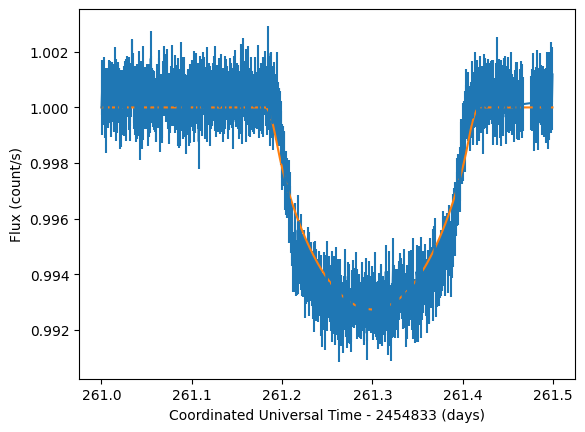
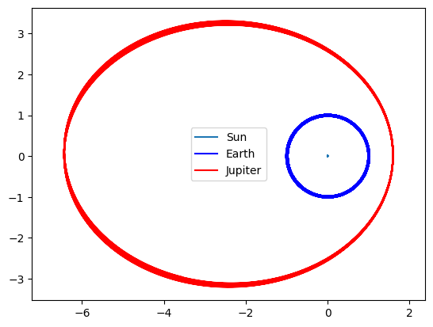
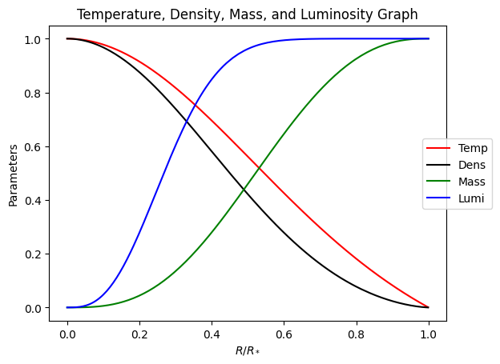

**Course:** Numerical Methods in Astrophysics

**Description:**
The first experience that I ever had with proper coding(I’ve only done Vex before) was in this course, of all courses, a graduate course in astrophysics. So, most of the content I learned by YouTube tutorials and friends who were in CS. The primary purpose of this course was to introduce numerical methods to solve the math behind astrophysical problems and, of course, model the universe.

Disclaimer: I am putting these here retroactively to showcase the sort of work I’ve done; however, I make significant changes to problems, wording, and remove searchable names so as to not explicitly give solutions to students who may take this course or similar courses in the future.

**Basic rundown  of my work:**
1. Introductory material, dealing with defining functions and learning how to use methods.
2. Introducing new numerical methods like trapezoidal rule and Monte-Carlo integration.
3. Introduction to light curves and using real data.

4. Dealing with coupled differential equations like the runge-kutta method in the context of hydrostatic equilibrium.
5. N-body simulation.

6. Presenting an idea for the final project.
7. Proper statistical treatment of light curves.
8. Introduction to machine learning and decision trees to identify RR Lyrae stars.
9. Final project: Modeling a main sequence star in hydrostatic equilibrium.

